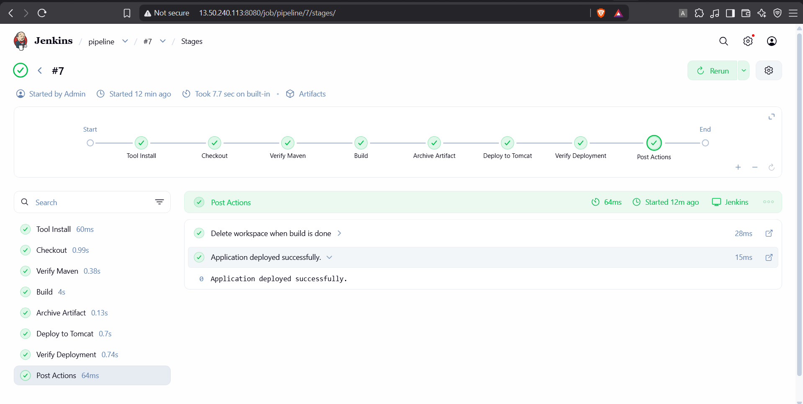
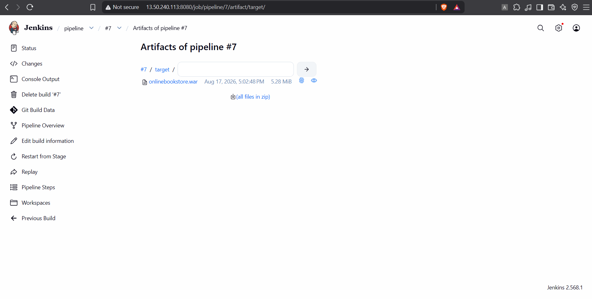
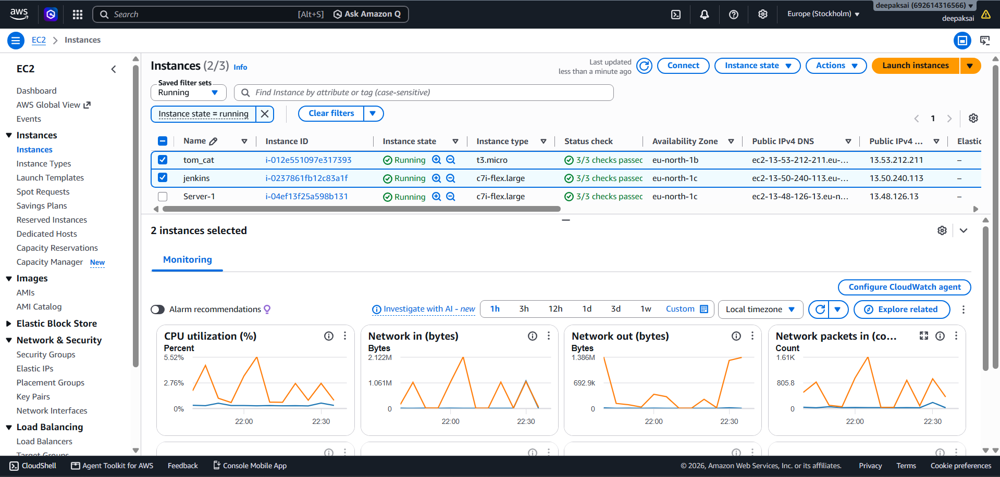
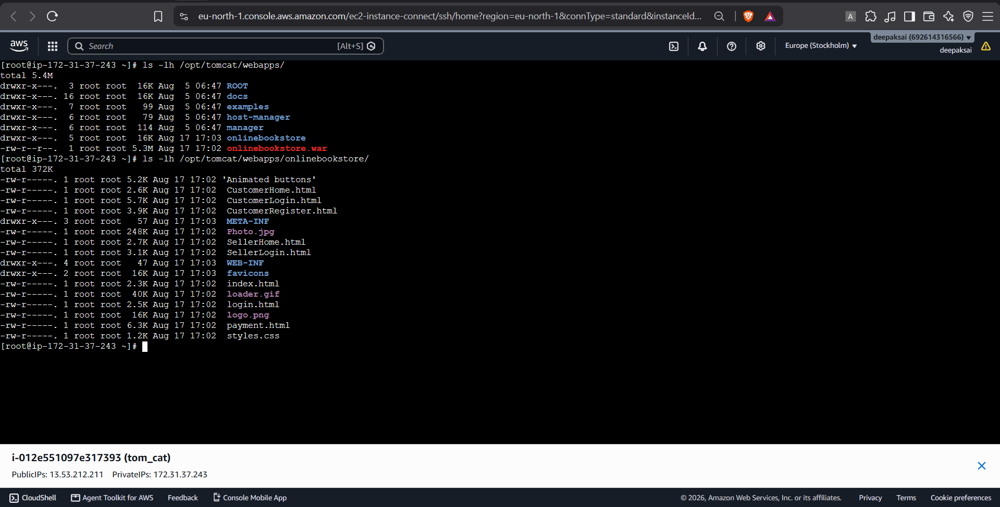
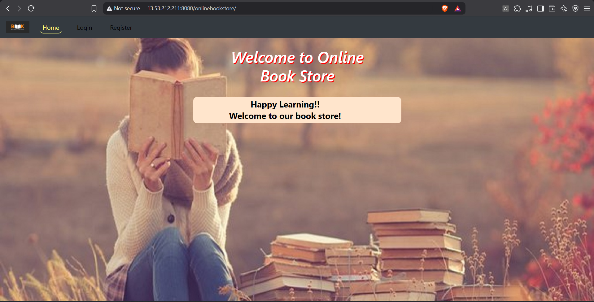

# CI/CD Deployment of an Online Bookstore with Jenkins and Apache Tomcat

This project demonstrates a complete CI/CD workflow for a Java web application. Jenkins checks out the source, verifies Maven, creates a WAR file, archives it, deploys it over SSH to a separate Apache Tomcat EC2 instance, verifies the deployment, and cleans the workspace.

## Architecture

```text
Developer → GitHub → Jenkins EC2 → Maven build → WAR artifact
                                      │
                                      └─ SSH/SCP → Tomcat EC2 → Online Bookstore
```

## Stack

| Area | Technology |
|---|---|
| Cloud | AWS EC2 (Amazon Linux) |
| CI/CD | Jenkins Declarative Pipeline |
| Build | Java and Maven |
| Application server | Apache Tomcat |
| Source control | Git and GitHub |
| Deployment | SSH and SCP |

## Pipeline stages

1. Tool Install
2. Checkout
3. Verify Maven
4. Build
5. Archive Artifact
6. Deploy to Tomcat
7. Verify Deployment
8. Post Actions / workspace cleanup

The Jenkins job archives `target/onlinebookstore.war` and copies it to `/opt/tomcat/webapps/`. Tomcat expands the WAR and serves the application at `/onlinebookstore/`.

## Prerequisites

- A Jenkins EC2 instance with Java 17, Maven, Git, and the Pipeline, Git, SSH Agent, Credentials Binding, and Workspace Cleanup plugins.
- A separate Tomcat EC2 instance with port `8080` open and Tomcat installed at `/opt/tomcat`.
- An SSH credential in Jenkins with ID `tomcat-ssh` for the Tomcat host.
- Security-group access: TCP `22` between Jenkins and Tomcat; TCP `8080` for the Jenkins and Tomcat web interfaces as needed.

## Deployment verification

The final successful run confirms every stage passed, including deployment verification and cleanup.



Jenkins archived the 5.28 MiB WAR artifact:



The AWS console shows separate Jenkins and Tomcat instances running:



On the Tomcat host, both `onlinebookstore.war` and its expanded deployment directory are present in `/opt/tomcat/webapps/`:



The deployed application is available at:

```text
http://<tomcat-public-ip>:8080/onlinebookstore/
```



## Jenkinsfile outline

```groovy
pipeline {
    agent any
    stages {
        stage('Checkout') { steps { checkout scm } }
        stage('Verify Maven') { steps { sh 'mvn --version && java -version' } }
        stage('Build') { steps { sh 'mvn clean package' } }
        stage('Archive Artifact') { steps { archiveArtifacts artifacts: 'target/*.war' } }
        stage('Deploy to Tomcat') {
            steps {
                sshagent(credentials: ['tomcat-ssh']) {
                    sh 'scp target/*.war $TOMCAT_USER@$TOMCAT_HOST:/opt/tomcat/webapps/'
                }
            }
        }
    }
    post { always { cleanWs() } }
}
```

> Keep host values and SSH keys in Jenkins credentials or environment configuration—never commit them to the repository.

## Resume-ready description

Built an end-to-end Jenkins CI/CD pipeline for a Java Online Bookstore application, using Maven to package a WAR, Jenkins to archive artifacts, and SSH/SCP to deploy automatically to Apache Tomcat on a separate AWS EC2 instance. Added deployment verification and workspace cleanup for a repeatable delivery workflow.
